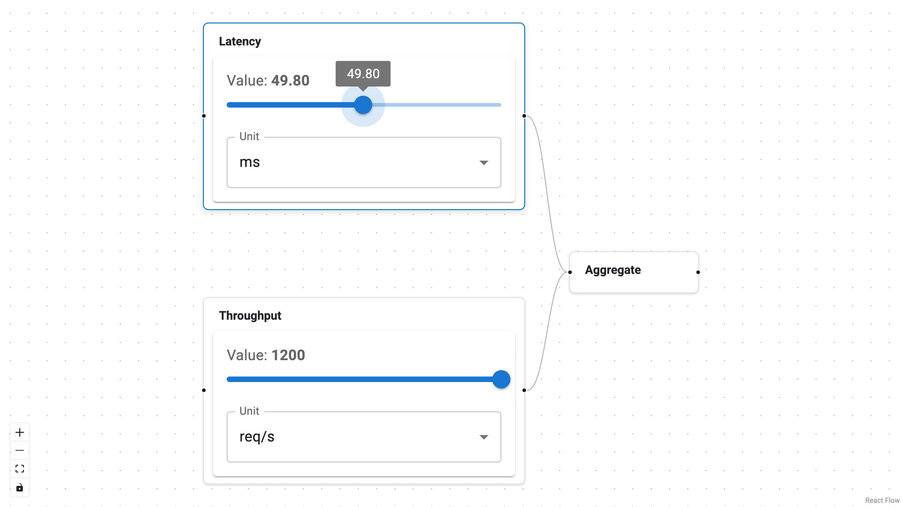
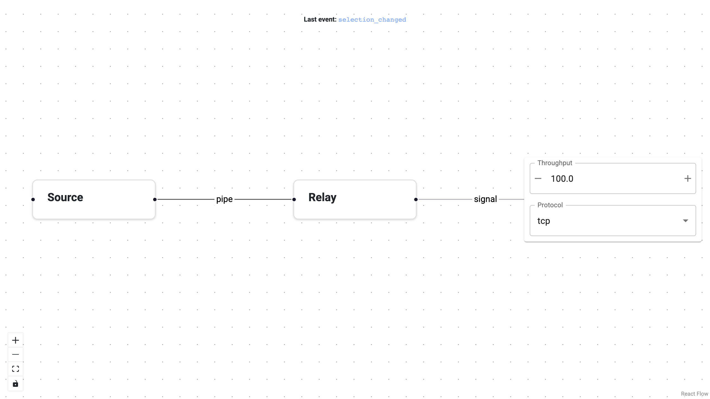
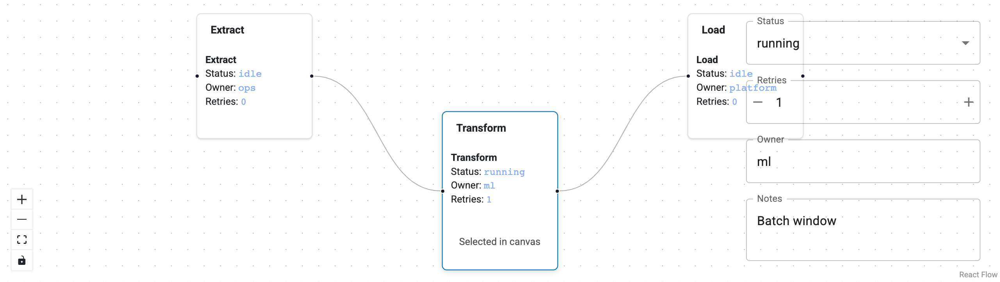
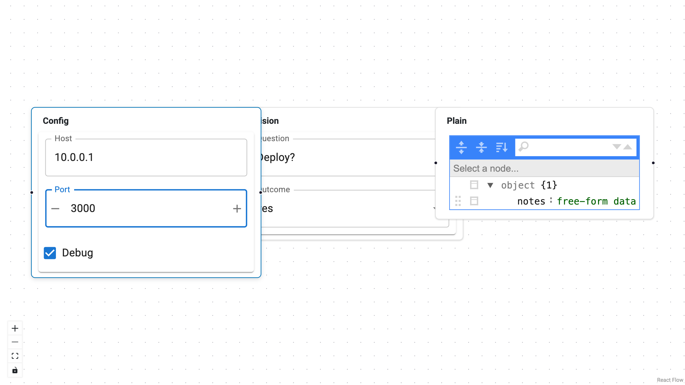
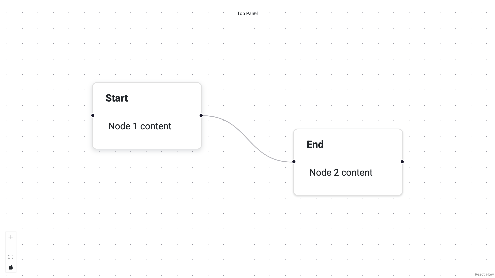
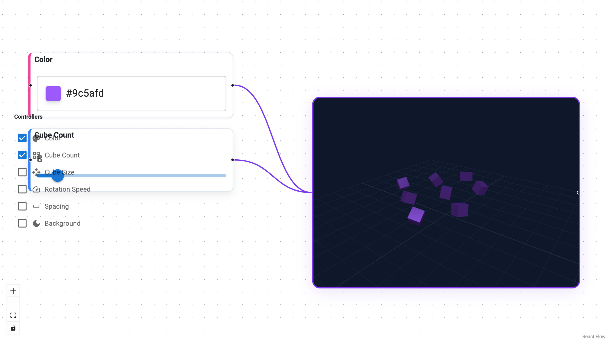
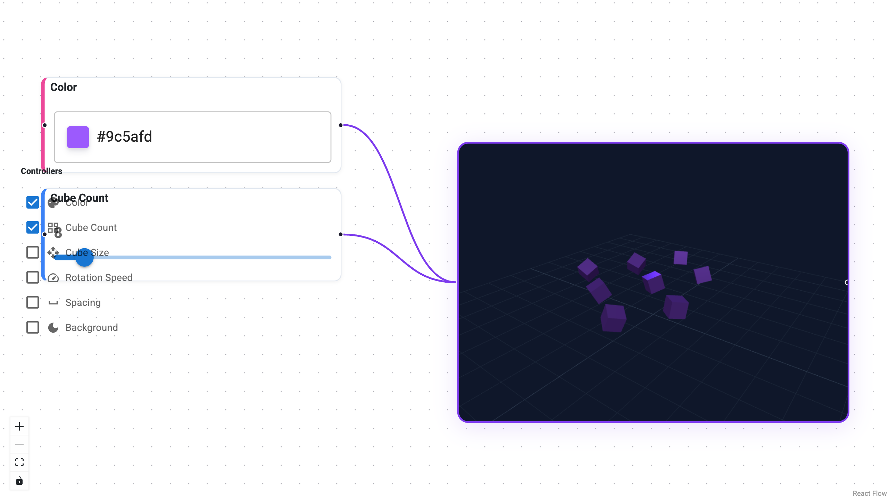

# Examples Gallery

Browse runnable examples from `examples/`. Each card links to a dedicated page
with a screenshot and full source code.

- 

    ---

    **[Advanced](advanced.md)**
    Schema-driven task nodes with event tracking.

- 

    ---

    **[Custom Editor](custom-editor.md)**
    Callable node editor with custom widgets.

- 

    ---

    **[Edge Editors](edge-editors.md)**
    Schema-backed and callable edge editors.

- 

    ---

    **[Node/Edge Instances](node-edge-instances.md)**
    Class-based nodes and edges with hooks.

- 

    ---

    **[Schema Types](schema-types.md)**
    Multiple node types, each with its own schema.

- 

    ---

    **[Simple](simple.md)**
    Minimal graph setup with top panel.

- 

    ---

    **[ThreeJS Viewer](threejs-viewer.md)**
    Graph-driven 3D cube viewer controls.

- 

    ---

    **[ThreeJS Viewer (Instances)](threejs-viewer-instances.md)**
    ThreeJS viewer with Node and Edge instances.

