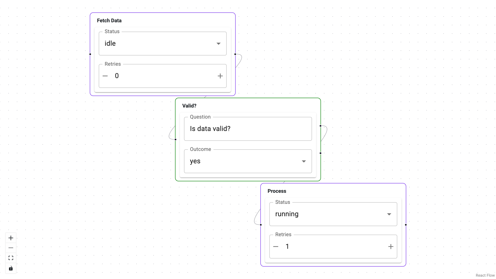

# Declare Node & Edge Types

Node and edge types are lightweight descriptors that tell Panel-ReactFlow
**what kind of data a node or edge carries**.  A type defines a name, an
optional display label, optional input/output ports (for nodes), and an
optional JSON Schema for its `data` payload.

Types are separate from editors.  A type says "a *task* node has a
*status* string and a *priority* integer"; an editor says "render a
dropdown and a number input for those fields."  This separation lets you
reuse the same type with different editors, or rely on the auto-generated
form.



---

## Node types

Use `NodeType` to describe a node type.  Provide `inputs` and `outputs` to
control the handles (ports) shown on each side of the node.

```python
from panel_reactflow import NodeType

task_schema = {
    "type": "object",
    "properties": {
        "status": {"type": "string", "enum": ["idle", "running", "done"]},
        "priority": {"type": "integer"},
    },
}

node_types = {
    "task": NodeType(
        type="task",
        label="Task",
        schema=task_schema,
        inputs=["in"],
        outputs=["out"],
    ),
}
```

---

## Edge types

Use `EdgeType` to describe an edge type.  Edges with a schema get the same
auto-generated editor support as nodes.

```python
from panel_reactflow import EdgeType

edge_types = {
    "pipe": EdgeType(
        type="pipe",
        label="Pipe",
        schema={
            "type": "object",
            "properties": {
                "throughput": {"type": "number"},
                "protocol": {"type": "string", "enum": ["tcp", "udp", "http"]},
            },
        },
    ),
}
```

---

## Schema sources

The `schema` field accepts multiple formats.  All are normalized to
JSON Schema before being sent to the frontend or used by editors.

| Source | Example |
|--------|---------|
| **JSON Schema dict** | `{"type": "object", "properties": {...}}` |
| **Param class** | A `param.Parameterized` subclass |
| **Pydantic model** | A `pydantic.BaseModel` subclass |

### Param class shorthand

```python
import param
from panel_reactflow import NodeType

class Job(param.Parameterized):
    status = param.Selector(objects=["idle", "running", "done"])
    retries = param.Integer(default=0)

node_types = {"job": NodeType(type="job", label="Job", schema=Job)}
```

### Pydantic model shorthand

```python
from pydantic import BaseModel
from panel_reactflow import NodeType

class Config(BaseModel):
    host: str = "localhost"
    port: int = 8080

node_types = {"config": NodeType(type="config", label="Config", schema=Config)}
```

---

## Register on ReactFlow

Pass types as dictionaries keyed by type name.

```python
flow = ReactFlow(
    nodes=nodes,
    edges=edges,
    node_types=node_types,
    edge_types=edge_types,
)
```

Types without a schema still work — the node or edge simply has no
schema-driven validation or auto-generated form.
