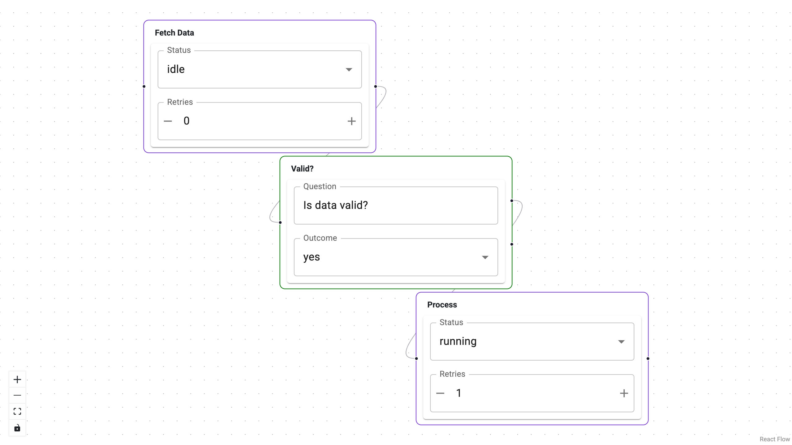

# Declare Node & Edge Types

Node and edge types are lightweight descriptors that define **what data each
kind of node/edge carries**. A type can provide:

- a type name (`type`)
- a display label (`label`)
- node handles (`inputs` / `outputs`)
- a schema for the `data` payload (`schema`)

Types are separate from editors. A type defines structure; an editor defines
the UI used to edit it.



---

## Complete runnable example

This script is a minimal, working example that produces the visualization
shown above.

```python
import param
import panel as pn

from panel_reactflow import EdgeType, NodeType, ReactFlow

pn.extension("jsoneditor")


class Job(param.Parameterized):
    status = param.Selector(objects=["idle", "running", "done"])
    retries = param.Integer(default=0)


decision_schema = {
    "type": "object",
    "properties": {
        "question": {"type": "string", "title": "Question"},
        "outcome": {
            "type": "string",
            "enum": ["yes", "no", "maybe"],
            "title": "Outcome",
        },
    },
}

node_types = {
    "job": NodeType(type="job", label="Job", schema=Job, inputs=["in"], outputs=["out"]),
    "decision": NodeType(
        type="decision",
        label="Decision",
        schema=decision_schema,
        inputs=["in"],
        outputs=["yes", "no"],
    ),
}

edge_types = {
    "flow": EdgeType(
        type="flow",
        label="Flow",
        schema={
            "type": "object",
            "properties": {"weight": {"type": "number", "title": "Weight"}},
        },
    ),
}

nodes = [
    {
        "id": "j1",
        "type": "job",
        "label": "Fetch Data",
        "position": {"x": 0, "y": 0},
        "data": {"status": "idle", "retries": 0},
    },
    {
        "id": "d1",
        "type": "decision",
        "label": "Valid?",
        "position": {"x": 300, "y": 250},
        "data": {"question": "Is data valid?", "outcome": "yes"},
    },
    {
        "id": "j2",
        "type": "job",
        "label": "Process",
        "position": {"x": 600, "y": 400},
        "data": {"status": "running", "retries": 1},
    },
]

edges = [
    {"id": "e1", "source": "j1", "target": "d1", "type": "flow", "data": {"weight": 1.0}},
    {"id": "e2", "source": "d1", "target": "j2", "type": "flow", "data": {"weight": 0.8}},
]

TASK_NODE_CSS = """
.react-flow__node-job {
    background-color: white;
    border-radius: 8px;
    border: 1.5px solid #7c3aed;
}

.react-flow__node-decision {
    background-color: white;
    border-radius: 8px;
    border: 1.5px solid green;
}
"""

flow = ReactFlow(
    nodes=nodes,
    edges=edges,
    node_types=node_types,
    edge_types=edge_types,
    editor_mode="node",
    sizing_mode="stretch_both",
    stylesheets=[TASK_NODE_CSS]
)

pn.Column(flow, sizing_mode="stretch_both").servable()
```

## How this code maps to the visualization

- `node_types["job"]` and `node_types["decision"]` define the two node kinds you see.
- `inputs` and `outputs` define the left/right handles rendered on each node.
- `edge_types["flow"]` defines the edge payload schema used by both connections.
- `nodes` controls labels (`Fetch Data`, `Valid?`, `Process`) and positions.
- `editor_mode="side"` makes selection open the schema-driven editor in the right panel.

---

## Node type snippet

Use `NodeType` to define node handles and payload schema.

```python
from panel_reactflow import NodeType

task_schema = {
    "type": "object",
    "properties": {
        "status": {"type": "string", "enum": ["idle", "running", "done"]},
        "priority": {"type": "integer"},
    },
}

node_types = {
    "task": NodeType(
        type="task",
        label="Task",
        schema=task_schema,
        inputs=["in"],
        outputs=["out"],
    ),
}
```

## Edge type snippet

Use `EdgeType` for edge payload schema and label.

```python
from panel_reactflow import EdgeType

edge_types = {
    "pipe": EdgeType(
        type="pipe",
        label="Pipe",
        schema={
            "type": "object",
            "properties": {
                "throughput": {"type": "number"},
                "protocol": {"type": "string", "enum": ["tcp", "udp", "http"]},
            },
        },
    ),
}
```

---

## Schema sources

The `schema` field accepts multiple inputs and normalizes them to JSON Schema.

| Source | Example |
|--------|---------|
| **JSON Schema dict** | `{"type": "object", "properties": {...}}` |
| **Param class** | A `param.Parameterized` subclass |
| **Pydantic model** | A `pydantic.BaseModel` subclass |

### Param class shorthand

```python
import param
from panel_reactflow import NodeType

class Job(param.Parameterized):
    status = param.Selector(objects=["idle", "running", "done"])
    retries = param.Integer(default=0)

node_types = {"job": NodeType(type="job", label="Job", schema=Job)}
```

### Pydantic model shorthand

```python
from pydantic import BaseModel
from panel_reactflow import NodeType

class Config(BaseModel):
    host: str = "localhost"
    port: int = 8080

node_types = {"config": NodeType(type="config", label="Config", schema=Config)}
```

---

## Register on `ReactFlow`

Pass `node_types` and `edge_types` as dictionaries keyed by type name:

```python
flow = ReactFlow(
    nodes=nodes,
    edges=edges,
    node_types=node_types,
    edge_types=edge_types,
)
```

Types without a schema still work; they just do not get schema-driven
validation or auto-generated forms.
