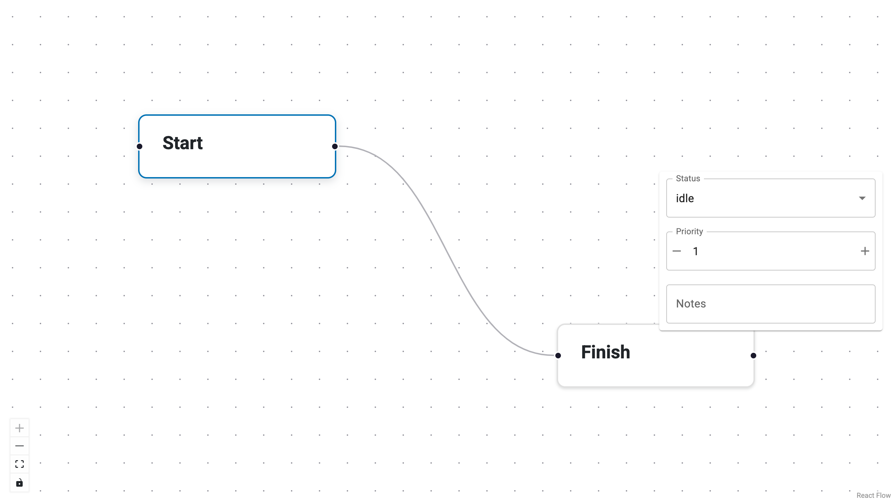
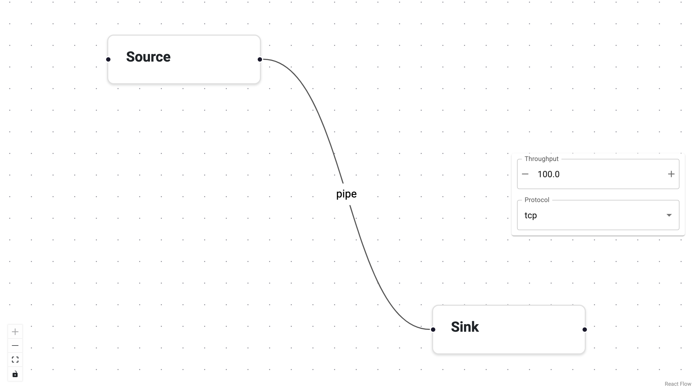

# Define Editors

Editors give users a way to view and modify the `data` payload of a node or
edge at runtime.  Panel-ReactFlow **decouples editors from types**: you
register editors separately, so you can swap editing UI without touching
your type definitions.

Both node editors and edge editors share the exact same interface.  If you
can build a node editor, you already know how to build an edge editor.

When a user selects a node (or an edge), Panel-ReactFlow looks up the
matching editor, creates the view, and displays it in the configured panel.
If no editor is registered for a type, the built-in `SchemaEditor` is
used: it auto-generates a form from the JSON Schema if one is present,
or falls back to a raw JSON editor.

{: .screenshot-placeholder }

---

## Editor signature

Every editor — whether a simple function, a lambda, or a class — receives
the same arguments:

```
editor(data, schema, *, id, type, on_patch) -> Viewable
```

| Argument   | Description |
|------------|-------------|
| `data`     | The current `data` dict of the node or edge. |
| `schema`   | The normalized JSON Schema (or `None`). |
| `id`       | The node or edge ID. |
| `type`     | The node or edge type name. |
| `on_patch` | Callback: call `on_patch({"key": value})` to push a partial update. |

---

## Built-in editors

Panel-ReactFlow ships two built-in editor classes:

| Class              | Behavior |
|--------------------|----------|
| `SchemaEditor` | Renders a form generated from the JSON Schema. Falls back to a raw JSON editor when no schema is available. **This is the default.** |
| `JsonEditor`   | Always renders a raw JSON editor (powered by `panel.pane.JSON`). |

```python
from panel_reactflow import JsonEditor, ReactFlow, SchemaEditor

flow = ReactFlow(
    nodes=nodes,
    edges=edges,
    default_node_editor=SchemaEditor,   # already the default
    default_edge_editor=JsonEditor,      # override for edges
)
```

---

## Node editors

### Register a callable editor for a node type

The simplest way to provide a custom node editor is a plain function that
returns a Panel viewable.

```python
import panel_material_ui as pmui
from panel_reactflow import ReactFlow

def metric_editor(data, schema, *, id, type, on_patch):
    value = pmui.FloatSlider(value=data.get("value", 0), start=0, end=100)
    unit = pmui.Select(value=data.get("unit", "ms"), options=["ms", "s", "%"])
    value.param.watch(lambda e: on_patch({"value": e.new}), "value")
    unit.param.watch(lambda e: on_patch({"unit": e.new}), "value")
    return pmui.Column(value, unit)

flow = ReactFlow(
    nodes=nodes,
    edges=edges,
    node_editors={"metric": metric_editor},
)
```

### Set a default node editor

If you want *all* node types to use the same custom editor, set
`default_node_editor` instead of mapping each type individually.

```python
flow = ReactFlow(
    nodes=nodes,
    edges=edges,
    default_node_editor=metric_editor,
)
```

---

## Edge editors

Edge editors work identically.  Register them via `edge_editors` (keyed by
edge type) or `default_edge_editor` for a blanket default.

{: .screenshot-placeholder }

### Schema-driven edge editor

If you declare an `EdgeType` with a schema and do not provide an explicit
editor, the default `SchemaEditor` auto-generates a form — the same
as for nodes.

```python
from panel_reactflow import EdgeType, ReactFlow

edge_types = {
    "pipe": EdgeType(
        type="pipe",
        label="Pipe",
        schema={
            "type": "object",
            "properties": {
                "throughput": {"type": "number", "title": "Throughput"},
                "protocol": {
                    "type": "string",
                    "enum": ["tcp", "udp", "http"],
                    "title": "Protocol",
                },
            },
        },
    ),
}

flow = ReactFlow(
    nodes=nodes,
    edges=edges,
    edge_types=edge_types,
    # No edge_editors needed — SchemaEditor handles "pipe" automatically.
)
```

### Custom callable edge editor

```python
import panel_material_ui as pmui
from panel_reactflow import EdgeType, ReactFlow

def signal_editor(data, schema, *, id, type, on_patch):
    freq = pmui.FloatSlider(
        value=data.get("frequency", 1.0), start=0.1, end=100, step=0.1,
        label="Frequency (Hz)",
    )
    active = pmui.Checkbox(value=data.get("active", True), label="Active")
    freq.param.watch(lambda e: on_patch({"frequency": e.new}), "value")
    active.param.watch(lambda e: on_patch({"active": e.new}), "value")
    return pmui.Paper(pmui.Column(freq, active, margin=5), margin=0)

flow = ReactFlow(
    nodes=nodes,
    edges=edges,
    edge_types={"signal": EdgeType(type="signal", label="Signal")},
    edge_editors={"signal": signal_editor},
)
```

---

## Class-based editors

For editors with complex state or lifecycle needs, subclass `Editor`.
The base class stores `data`, `schema`, `id`, `type`, and `on_patch` for
you.  Implement `__panel__()` to return the view.

Class-based editors work for both nodes and edges.

```python
import panel as pn
from panel_reactflow import Editor

class TitleEditor(Editor):
    def __init__(self, data, schema, **kwargs):
        super().__init__(data, schema, **kwargs)
        self._input = pn.widgets.TextInput(value=data.get("title", ""))
        self._input.param.watch(self._on_title_change, "value")

    def _on_title_change(self, event):
        if self._on_patch is not None:
            self._on_patch({"title": event.new})

    def __panel__(self):
        return self._input
```

Register it like any callable:

```python
flow = ReactFlow(
    nodes=nodes, edges=edges,
    node_editors={"article": TitleEditor},
    edge_editors={"comment": TitleEditor},  # reuse the same class
)
```

---

## Editor display modes

Control where node editors appear with `editor_mode`:

| Mode      | Description |
|-----------|-------------|
| `"side"`  | Side panel to the right of the canvas. |
| `"node"`  | Inline, directly inside the selected node. |
| `"toolbar"` | In the top toolbar area. |

Edge editors always appear in the **side panel** (right side of the
canvas).

```python
flow = ReactFlow(
    nodes=nodes,
    edges=edges,
    editor_mode="side",
)
```

---

## Tips

- Call `on_patch({"key": value})` for data changes.  Labels are top-level
  and should be updated by replacing the node/edge in `flow.nodes` or
  `flow.edges`.
- You can mix strategies: use schema-driven editors for most types and
  custom editors only where you need full control.
- The same editor class or function can be registered for both node and
  edge types.
