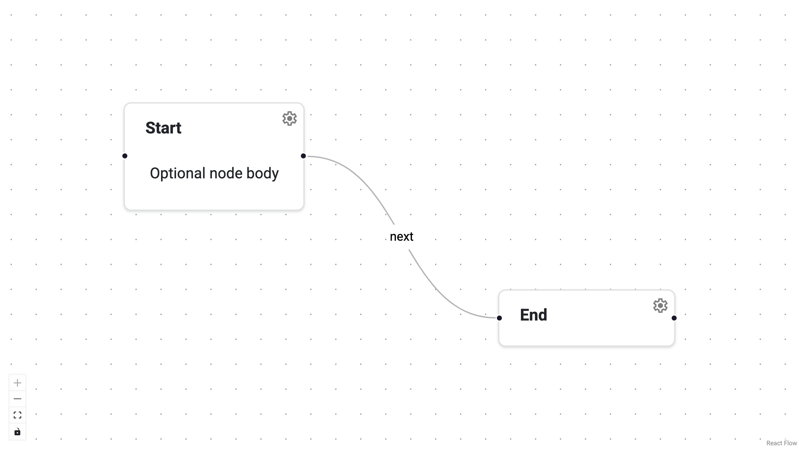

# Define Nodes & Edges

Every graph in Panel-ReactFlow is built from two lists: **nodes** and
**edges**.  Nodes represent entities on the canvas; edges represent
connections between them.  Both are plain Python dictionaries, so you can
construct them from any data source — a database, a config file, or user
input at runtime.

This guide covers how to create nodes and edges, use the helper dataclasses,
and update data after the graph is live.



---

## Define nodes

A node dict requires `id`, `position`, and `data`.  The display label is a
**top-level** field — keep it out of `data` so the frontend can render it
without parsing the payload.

```python
import panel as pn

nodes = [
    {
        "id": "n1",
        "type": "panel",
        "label": "Start",
        "position": {"x": 0, "y": 0},
        "data": {"status": "idle"},
    },
    {
        "id": "n2",
        "type": "panel",
        "label": "End",
        "position": {"x": 260, "y": 60},
        "data": {"status": "done"},
        "view": pn.pane.Markdown("Optional node body"),
    },
]
```

| Key        | Required | Description |
|------------|----------|-------------|
| `id`       | yes      | Unique string identifier. |
| `position` | yes      | `{"x": float, "y": float}` canvas coordinates. |
| `data`     | yes      | Arbitrary dict of payload data. |
| `label`    | no       | Display text shown in the node header. |
| `type`     | no       | Node type name (default `"panel"`). |
| `view`     | no       | A Panel viewable rendered inside the node. |

---

## Define edges

Edges link two nodes by their `id`.  Use the top-level `label` for the
text shown on the edge.

```python
edges = [
    {"id": "e1", "source": "n1", "target": "n2", "label": "next"},
]
```

| Key            | Required | Description |
|----------------|----------|-------------|
| `id`           | yes      | Unique string identifier. |
| `source`       | yes      | ID of the source node. |
| `target`       | yes      | ID of the target node. |
| `label`        | no       | Text rendered on the edge. |
| `type`         | no       | Edge type name (for styling / editors). |
| `data`         | no       | Arbitrary dict of payload data. |
| `sourceHandle` | no       | Specific output handle on the source node. |
| `targetHandle` | no       | Specific input handle on the target node. |

---

## Use the NodeSpec / EdgeSpec helpers

If you prefer a typed API, use the dataclass helpers.  They validate fields
at construction time and are **automatically converted to dictionaries** when
passed to `ReactFlow`.

```python
from panel_reactflow import NodeSpec, EdgeSpec, ReactFlow

# Create nodes and edges using NodeSpec/EdgeSpec
nodes = [
    NodeSpec(
        id="n1",
        type="panel",
        label="Start",
        position={"x": 0, "y": 0},
        data={"status": "idle"},
    ),
    NodeSpec(
        id="n2",
        type="panel",
        label="End",
        position={"x": 260, "y": 60},
        data={"status": "done"},
    ),
]

edges = [
    EdgeSpec(
        id="e1",
        source="n1",
        target="n2",
        label="next",
    ),
]

# No need to call .to_dict() - automatic serialization!
flow = ReactFlow(nodes=nodes, edges=edges)
```

!!! note "Automatic Serialization"
    `NodeSpec` and `EdgeSpec` objects are automatically converted to dictionaries
    when passed to `ReactFlow`. You don't need to call `.to_dict()` manually.

    However, `.to_dict()` is still available if you need to convert them explicitly
    for other use cases:

    ```python
    node_dict = NodeSpec(id="n1", position={"x": 0, "y": 0}).to_dict()
    ```

---

## Connect to specific handles

When a node type defines multiple input or output handles (via `inputs=["a", "b"]` or `outputs=["x", "y"]`), you can route edges to specific handles using `sourceHandle` and `targetHandle`.

```python
from panel_reactflow import ReactFlow, NodeSpec, EdgeSpec, NodeType

# Define node types with multiple handles
node_types = {
    "producer": NodeType(
        type="producer",
        label="Producer",
        inputs=[],
        outputs=["result", "error"]
    ),
    "consumer": NodeType(
        type="consumer",
        label="Consumer",
        inputs=["data", "config"],
        outputs=[]
    ),
}

# Create nodes
nodes = [
    NodeSpec(id="p", type="producer", position={"x": 0, "y": 0}, label="Producer").to_dict(),
    NodeSpec(id="c", type="consumer", position={"x": 400, "y": 0}, label="Consumer").to_dict(),
]

# Connect producer's "result" output to consumer's "data" input
edges = [
    EdgeSpec(
        id="e1",
        source="p",
        target="c",
        sourceHandle="result",
        targetHandle="data"
    ).to_dict(),
]

flow = ReactFlow(nodes=nodes, edges=edges, node_types=node_types)
```

Without `sourceHandle` and `targetHandle`, edges connect to the default (first) handle on each node.

---

## Update data vs. label

`data` and `label` live in different places and are updated differently:

- **Data** — use `patch_node_data()` or `patch_edge_data()`.  This sends
  an incremental patch to the frontend without replacing the full list.
- **Label** — replace the node/edge in `flow.nodes` or `flow.edges`.

```python
# Patch a data field
flow.patch_node_data("n1", {"status": "running"})
flow.patch_edge_data("e1", {"weight": 0.75})

# Update a label
flow.nodes = [
    {**node, "label": "Start (running)"} if node["id"] == "n1" else node
    for node in flow.nodes
]
```

---

## Add and remove at runtime

You can use either plain dictionaries or `NodeSpec`/`EdgeSpec` objects with the
`add_node()` and `add_edge()` methods:

```python
# Using plain dictionaries
flow.add_node({"id": "n3", "position": {"x": 520, "y": 0}, "label": "New", "data": {}})
flow.add_edge({"source": "n2", "target": "n3", "data": {}})

# Or using NodeSpec/EdgeSpec (no .to_dict() needed)
from panel_reactflow import NodeSpec, EdgeSpec

flow.add_node(NodeSpec(id="n4", position={"x": 780, "y": 0}, label="Another"))
flow.add_edge(EdgeSpec(id="e2", source="n3", target="n4"))

flow.remove_node("n3")   # also removes connected edges
flow.remove_edge("e1")
```
