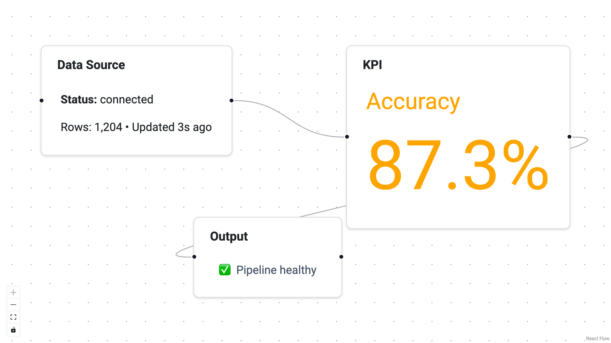

# Embed Views in Nodes

Nodes in Panel-ReactFlow can display more than a text label.  By passing a
Panel component as the `view` parameter, you can embed **any** Panel
viewable directly inside a node — a Markdown summary, a chart, an image,
an interactive widget, or even a complete mini-dashboard.

Views are rendered server-side with Bokeh and streamed into the React Flow
canvas, so they have the same interactivity and update behaviour as any
other Panel component.  This is ideal for at-a-glance previews: show a
sparkline on a data-source node, a status badge on a pipeline step, or a
thumbnail on an image-processing node.



---

## Add a view to a node

Set the `view` key when defining a node.  The value can be any Panel
`Viewable` — a pane, a widget, a layout, or a custom component.

```python
import panel as pn
from panel_reactflow import ReactFlow

nodes = [
    {
        "id": "source",
        "type": "panel",
        "label": "Data Source",
        "position": {"x": 0, "y": 0},
        "data": {},
        "view": pn.pane.Markdown("**Status:** connected"),
    },
    {
        "id": "chart",
        "type": "panel",
        "label": "Preview",
        "position": {"x": 300, "y": 0},
        "data": {},
        "view": pn.pane.Matplotlib(fig, tight=True),
    },
]

flow = ReactFlow(nodes=nodes, edges=[], sizing_mode="stretch_both")
```

---

## Add a view when adding a node at runtime

`add_node()` accepts an optional `view` keyword argument:

```python
flow.add_node(
    {"id": "live", "label": "Live Feed", "position": {"x": 600, "y": 0}, "data": {}},
    view=pn.indicators.Number(value=42, name="Metric"),
)
```

---

## Use interactive widgets as views

Because views are full Panel components, you can embed interactive widgets
and wire them up with callbacks:

```python
import panel_material_ui as pmui

toggle = pmui.Switch(value=True, label="Enabled")
toggle.param.watch(
    lambda e: flow.patch_node_data("ctrl", {"enabled": e.new}),
    "value",
)

nodes = [
    {
        "id": "ctrl",
        "type": "panel",
        "label": "Controller",
        "position": {"x": 0, "y": 0},
        "data": {"enabled": True},
        "view": toggle,
    },
]
```

---

## Views vs. editors

Views and editors serve different purposes:

| | Views | Editors |
|---|-------|---------|
| **Where** | Rendered *inside* the node on the canvas. | Rendered in a side/toolbar/node panel. |
| **When** | Always visible. | Shown when the node or edge is selected. |
| **Purpose** | At-a-glance display, inline controls. | Detailed data editing. |
| **Scope** | Nodes only. | Nodes and edges. |

You can use both on the same node — for example, a sparkline view inside
the node and a full form editor in the side panel.

---

## Tips

- Keep views compact.  Large views push nodes apart and clutter the canvas.
- Views update reactively.  If your view is backed by a reactive data
  source (e.g. a streaming `DataFrame`), it will refresh automatically.
- For read-only previews, `pn.pane.Markdown`, `pn.pane.HTML`, and
  `pn.indicators.*` are lightweight choices.
