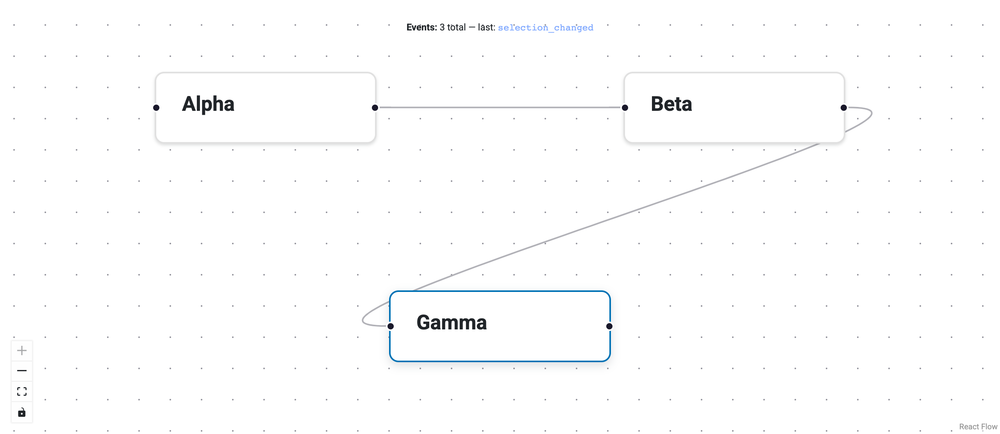

# React to Events

Panel-ReactFlow emits events whenever the user interacts with the graph —
clicking a node, dragging it to a new position, creating an edge, or
deleting an element.  You can subscribe to these events in Python and run
arbitrary logic in response: update a status bar, log changes, sync to an
external database, or trigger downstream computations.

Events are registered with `flow.on(event_type, callback)`.  The callback
receives a single dict containing the event payload.  You can also listen
for **all** events at once by subscribing to `"*"`.

{: .screenshot-placeholder }

---

## Available events

| Event name           | Fired when… | Key payload fields |
|----------------------|-------------|--------------------|
| `node_added`         | A node is added to the graph. | `node` |
| `node_deleted`       | A node is removed. | `node_id` |
| `node_moved`         | A node is dragged to a new position. | `node_id`, `position` |
| `node_clicked`       | A node is clicked (single click). | `node_id` |
| `node_data_changed`  | `patch_node_data()` is called. | `node_id`, `patch` |
| `edge_added`         | An edge is created (UI connect or API). | `edge` |
| `edge_deleted`       | An edge is removed. | `edge_id` |
| `edge_data_changed`  | `patch_edge_data()` is called. | `edge_id`, `patch` |
| `selection_changed`  | The active selection changes. | `nodes`, `edges` |
| `sync`               | A batch sync from the frontend. | *(varies)* |

---

## Listen for a single event type

```python
import panel as pn
from panel_reactflow import ReactFlow

flow = ReactFlow(nodes=nodes, edges=edges, sizing_mode="stretch_both")

log = pn.pane.Markdown("Waiting for events…")

def on_node_moved(payload):
    node_id = payload["node_id"]
    pos = payload["position"]
    log.object = f"**Moved** `{node_id}` → ({pos['x']:.0f}, {pos['y']:.0f})"

flow.on("node_moved", on_node_moved)

pn.Column(log, flow).servable()
```

---

## Listen for all events

Use the wildcard `"*"` to receive every event.  This is useful for
debugging or building a generic activity log.

```python
history = []
status = pn.pane.Markdown("")

def on_any_event(payload):
    history.append(payload.get("type", "unknown"))
    status.object = f"**Events so far:** {len(history)}"

flow.on("*", on_any_event)
```

---

## Respond to selection changes

`selection_changed` fires whenever the user clicks a node, an edge, or the
canvas background.  The payload includes lists of selected `nodes` and
`edges` IDs.

```python
details = pn.pane.JSON({}, depth=2)

def on_selection(payload):
    details.object = {
        "selected_nodes": payload.get("nodes", []),
        "selected_edges": payload.get("edges", []),
    }

flow.on("selection_changed", on_selection)
```

---

## Register multiple handlers

You can register as many handlers as you like for the same event — they
are called in the order they were registered.

```python
flow.on("node_added", save_to_database)
flow.on("node_added", update_status_bar)
flow.on("node_added", recalculate_layout)
```

---

## Tips

- Callbacks run on the server in the Panel event loop.  Keep them fast;
  offload heavy work with `pn.state.execute()` or background threads.
- Use `"*"` during development for a quick audit trail, then switch to
  specific event names in production.
- The `selection` parameter on `ReactFlow` also updates reactively.  If
  you only need to watch the current selection, you can use
  `flow.param.watch(callback, "selection")` instead of the event API.
