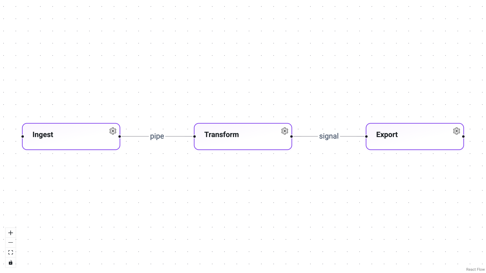

# Style Nodes & Edges

Panel-ReactFlow renders each node and edge with predictable CSS classes, so
you can apply any visual treatment — colors, borders, shadows, animations —
purely through CSS.  Styles are passed to the `ReactFlow` component via
its `stylesheets` parameter, which accepts a list of CSS strings or file
paths.

This approach keeps your styling concerns completely separate from your
Python logic and lets you iterate on visuals without restarting the server.



---

## How CSS classes are assigned

| Element | Class pattern | Example |
|---------|---------------|---------|
| Node by type | `.react-flow__node-{type}` | `.react-flow__node-task` |
| Edge by type | `.react-flow__edge-{type}` | `.react-flow__edge-pipe` |
| Edge path | `.react-flow__edge-path` | — |
| Edge label | `.react-flow__edge-text` | — |
| Selected | `.selected` (added to node or edge) | `.react-flow__node-task.selected` |
| Hoverable | `.selectable` (added to node) | `.react-flow__node-task.selectable:hover` |

---

## Style a node type

```python
TASK_NODE_CSS = """
.react-flow__node-task {
    border-radius: 8px;
    border: 1.5px solid #7c3aed;
    background: linear-gradient(168deg, #faf5ff 0%, #ffffff 60%);
    box-shadow: 0 1px 3px rgba(124, 58, 237, 0.10);
    min-width: 160px;
    transition: box-shadow 0.2s ease, border-color 0.2s ease;
}

.react-flow__node-task.selectable:hover {
    border-color: #6d28d9;
    box-shadow: 0 4px 12px rgba(124, 58, 237, 0.18);
    transform: translateY(-1px);
}

.react-flow__node-task.selected {
    border-color: #7c3aed;
    box-shadow: 0 0 0 2px rgba(124, 58, 237, 0.25),
                0 4px 14px rgba(124, 58, 237, 0.15);
}
"""

flow = ReactFlow(
    nodes=nodes,
    edges=edges,
    stylesheets=[TASK_NODE_CSS],
)
```

---

## Style edges globally

Target all edge paths and labels regardless of type:

```python
EDGE_CSS = """
.react-flow__edge-path {
    stroke: #64748b;
    stroke-width: 2px;
}
.react-flow__edge-text {
    fill: #475569;
    font-size: 12px;
}
"""
```

---

## Style by edge type

Just like nodes, edges receive a class based on their `type`.  Use this
to give different edge types distinct appearances:

```python
TYPED_EDGE_CSS = """
/* Solid blue for "pipe" edges */
.react-flow__edge-pipe .react-flow__edge-path {
    stroke: #2563eb;
    stroke-width: 2.5px;
}

/* Dashed red for "signal" edges */
.react-flow__edge-signal .react-flow__edge-path {
    stroke: #dc2626;
    stroke-width: 2px;
    stroke-dasharray: 6 3;
}
"""
```

---

## Combine multiple stylesheets

Pass multiple CSS strings (or a mix of strings and file paths) to
`stylesheets`.  They are applied in order, so later entries override
earlier ones.

```python
flow = ReactFlow(
    nodes=nodes,
    edges=edges,
    stylesheets=[TASK_NODE_CSS, EDGE_CSS, TYPED_EDGE_CSS],
)
```

---

## Style selected elements

The `.selected` class is added automatically when a user clicks a node or
edge.  Use it to provide clear visual feedback.

```python
SELECTION_CSS = """
.react-flow__node.selected {
    outline: 2px solid #2563eb;
    outline-offset: 2px;
}
.react-flow__edge.selected .react-flow__edge-path {
    stroke: #2563eb;
    stroke-width: 3px;
}
"""
```

---

## Tips

- Use CSS `transition` for smooth hover and selection effects.
- Scope styles to a node or edge type to keep visuals consistent across
  instances of the same type.
- For rapid prototyping, define styles as inline Python strings.  For
  production apps, move them to `.css` files and reference by path.
