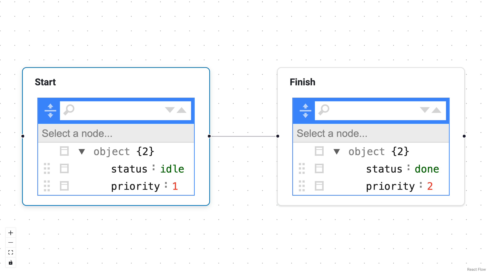

# Quickstart

Get a basic React Flow canvas running with labeled nodes, a single edge,
and schema-backed editors.  By the end of this page you will have an
interactive graph that auto-generates editing forms from a JSON Schema.

{: .screenshot-placeholder }

## Install

```bash
pip install panel-reactflow
```

## Minimal app

```python
import panel as pn

from panel_reactflow import NodeType, ReactFlow

pn.extension()

task_schema = {
    "type": "object",
    "properties": {
        "status": {"type": "string", "enum": ["idle", "running", "done"]},
        "priority": {"type": "integer"},
    },
}

nodes = [
    {
        "id": "start",
        "type": "task",
        "label": "Start",
        "position": {"x": 0, "y": 0},
        "data": {"status": "idle", "priority": 1},
    },
    {
        "id": "finish",
        "type": "task",
        "label": "Finish",
        "position": {"x": 260, "y": 60},
        "data": {"status": "done", "priority": 2},
    },
]

edges = [
    {"id": "e1", "source": "start", "target": "finish"},
]

flow = ReactFlow(
    nodes=nodes,
    edges=edges,
    node_types={"task": NodeType(type="task", label="Task", schema=task_schema)},
    editor_mode="node",
    sizing_mode="stretch_both",
)

flow.servable()
```

## Run

```bash
panel serve app.py --show
```

## What you just used

- `label` is a top-level node field (not part of `data`).
- `node_types` describe structure and schema only.
- The default editor auto-generates widgets from the JSON Schema.
